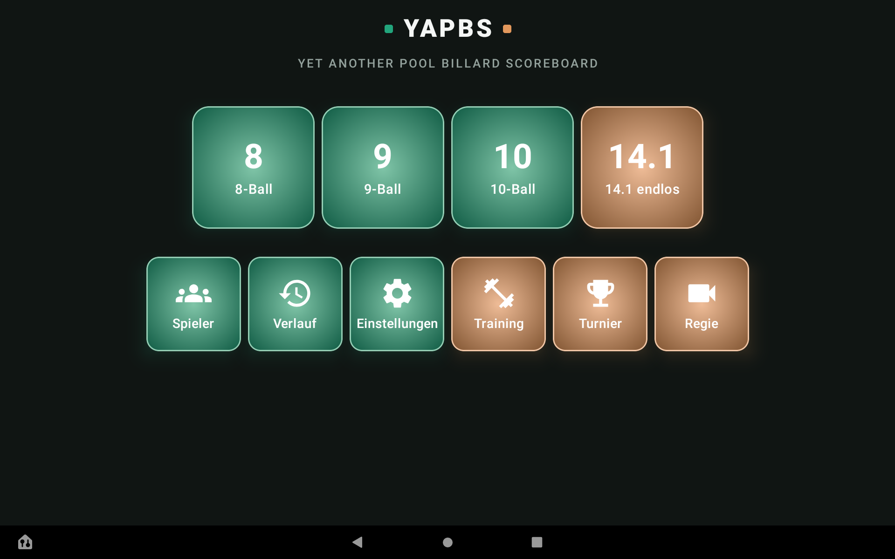
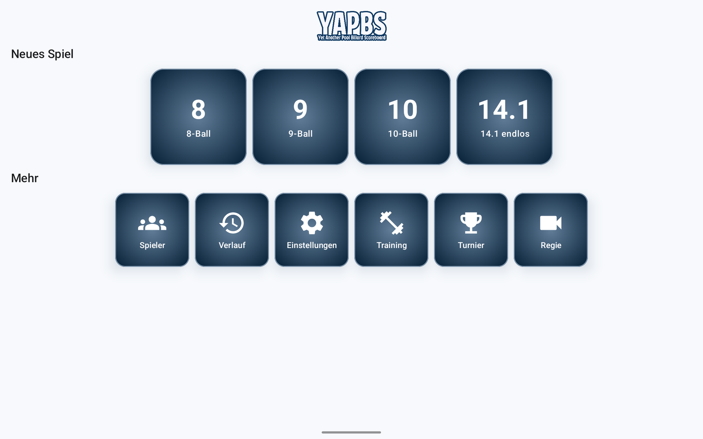
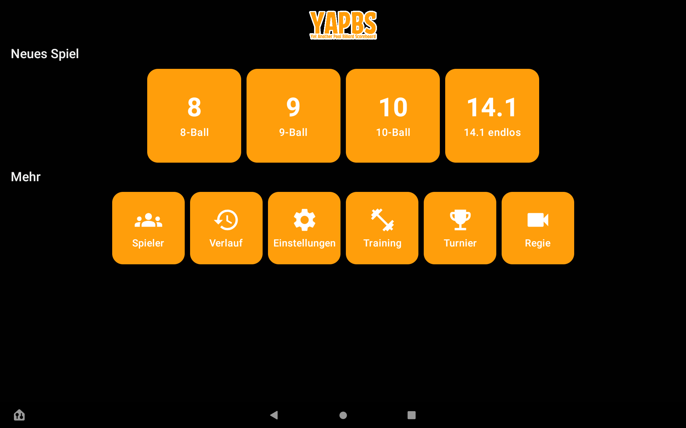
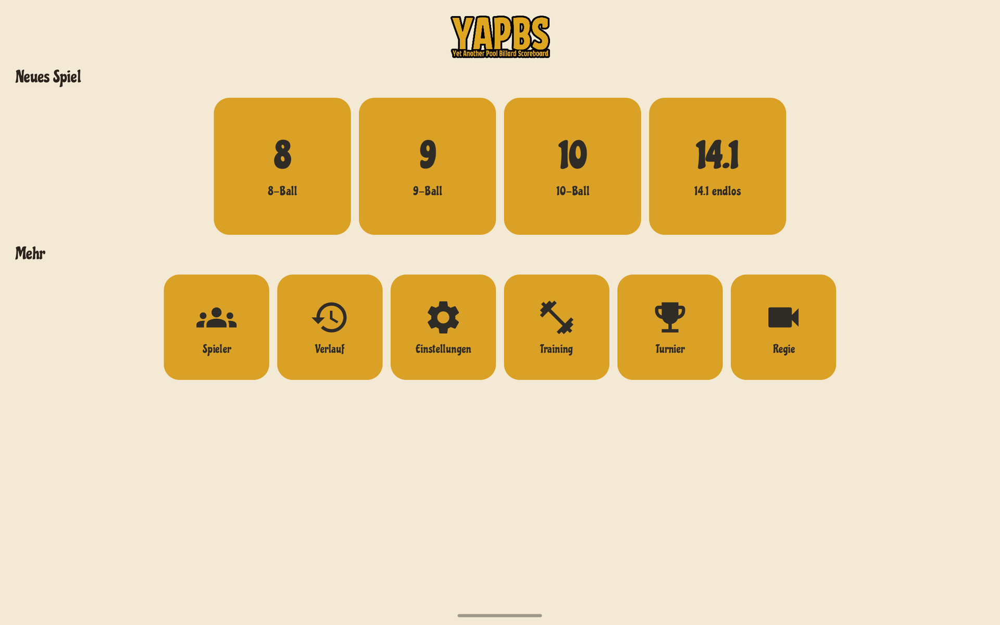
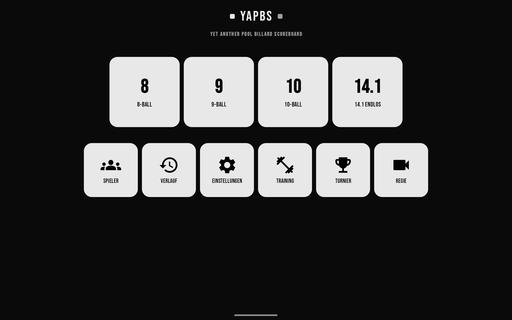
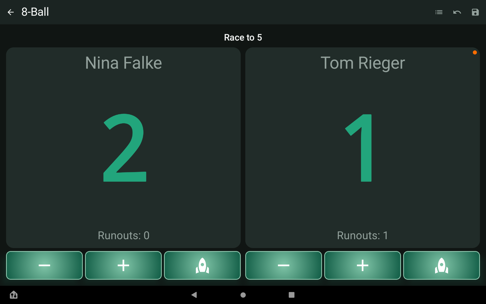
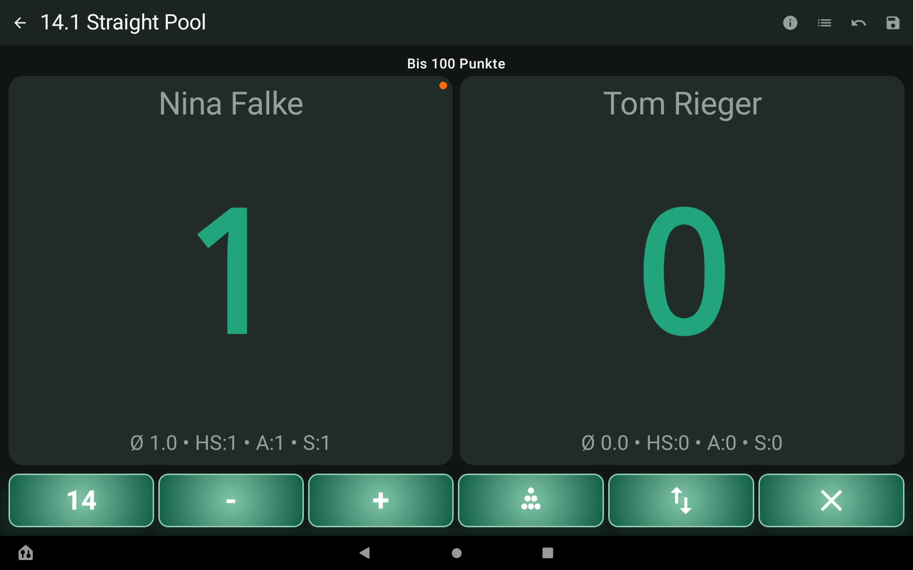
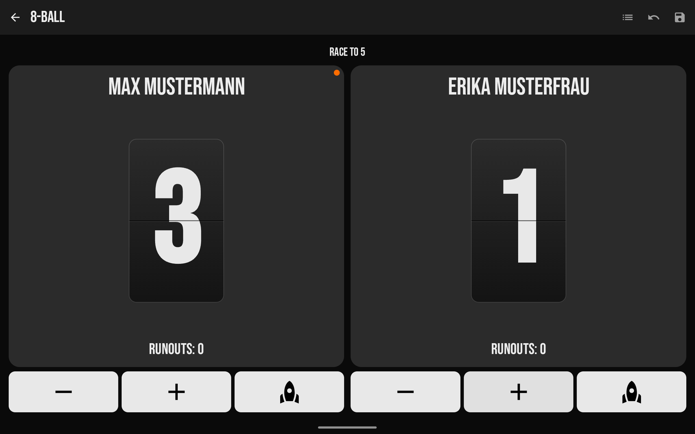

# YAPBS – Yet Another Pool Billiard Scoreboard

Kostenlose Android-App fürs digitale Scoreboard am Billardtisch – als Ersatz für Zettel und Kreidetafel, auf Tablet oder Handy.

## Status

Frühe Entwicklungsversion (v0.1.x) – kostenlos, Open Source, ohne Gewähr. Bugs/Feedback gerne über [Issues](https://github.com/4noxx/yapbs/issues), aber kein garantierter Support.

## Features

- **8-Ball, 9-Ball, 10-Ball und 14.1 endlos** – jeweils mit korrekter Regelumsetzung (14.1 inkl. Anstoßfoul/Wiederaufbau/Drei-Foul-Regel nach DBU-Regelwerk)
- **Turniermodus** (bis 8 Spieler, mehrere Turniermodi, Tabelle live)
- **Training** mit festen Übungen (High Run, Equal Offense 1–4) und optionalem Verlauf
- **Direktvergleich** zwischen zwei Spielern: Bilanz, Formkurve, Serien-Statistik, Filter nach Disziplin/Zeitraum
- **Verlauf** mit Filter nach Name/Disziplin/Jahr, konfigurierbare Aufbewahrungsdauer
- **OBS-Fernsteuerung** ("Regie"): Aufnahme/Stream direkt aus der App starten/stoppen/pausieren, Szenen-Elemente automatisch ein-/ausblenden, Wake-on-LAN für den Streaming-Rechner
- **Fünf Designs** (Light/Dark/Vintage/Felt/Flap), mehrsprachig (DE/EN/ES/FR)

## Screenshots

Namen und Vereine in den Screenshots sind frei erfunden.

| Felt | Light | Dark | Vintage | Flap |
| --- | --- | --- | --- | --- |
|  |  |  |  |  |

| 8-Ball | 14.1 endlos | 8-Ball (Flap) |
| --- | --- | --- |
|  |  |  |

## Datenschutz

Alle Daten (Spieler, Ergebnisse, Vereine) bleiben ausschließlich auf dem Gerät. Kein Konto, kein Tracking, keine Werbung – nichts wird an den Entwickler oder Dritte übertragen. Cloud-Backup und Geräte-zu-Geräte-Übertragung sind für die Datenbank ausdrücklich ausgeschlossen (siehe [`docs/DATENSCHUTZ.md`](docs/DATENSCHUTZ.md)).

## Selbst bauen

Voraussetzungen: JDK 17, Android SDK (`compileSdk 37`, `minSdk 28`).

```bash
git clone https://github.com/4noxx/yapbs.git
cd yapbs
./gradlew assembleRelease
```

Die fertige APK liegt danach unter `app/build/outputs/apk/release/app-release.apk`.

Für einen Debug-Build ohne eigene Signatur reicht:

```bash
./gradlew assembleDebug
```

Ein Release-Build ohne eigenen Signierschlüssel (`keystore/keystore.properties` fehlt lokal, der Ordner ist bewusst nicht Teil dieses Repos) fällt automatisch auf einen unsignierten Build zurück.

## Lizenz

[GPL-3.0](LICENSE) oder später.
